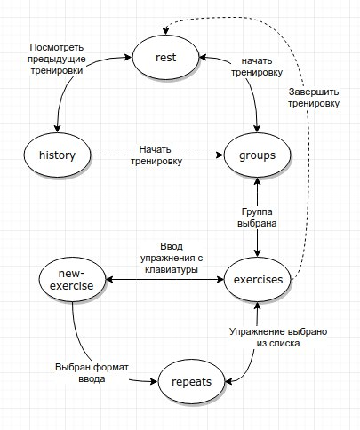

# gymBot

Телеграм бот для ведения дневника тренировок и отслеживания прогресса.

# Getting started

- `yarn`
- `npm start`
- `node exercises.js`

**Environment variables**

`TG_BOT_TOKEN` - should contain bot's token (required)  
`TELEGRAM_SESSION_HOST` - redis host (optional, localhost by default)  
`TELEGRAM_SESSION_PORT` - redis port (optional, 6379 by default)
`MONGO_HOST` - host of mongo container (optional, 127.0.0.1 by default)
`MONGO_PORT` - port where mongo is running (optional, 27017)

`SEED_MONGO` - set 'no' if uploading default exercises is not needed

## Scenes

1. rest
2. groups
3. history
4. exercises
5. repeats
6. new-exercise

